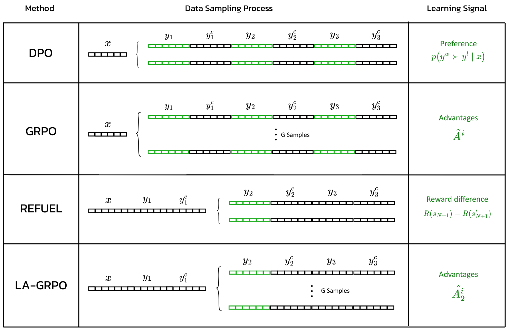

# Multiturn LLM Training

A simple and concise framework for training large language models (LLMs) to handle multi-turn conversations.

**Base code for the Master's thesis:**  
[Using the Advantage: Teaching LLMs to Negotiate in Multi-Turn Dialogues with Local Advantage GRPO](https://drive.google.com/file/d/1LnP1im742NEbg5YeG_Icjx1kq-dJERdV/view?usp=sharing)  
*(Paper currently in progress)*

---

### 🧠 Methods Implemented

- **REFUEL** — https://github.com/ZhaolinGao/REFUEL  
- **Token-based-DPO** — https://arxiv.org/pdf/2404.12358  
- **GRPO** — https://arxiv.org/pdf/2501.12948  
- **LA-GRPO** — https://drive.google.com/file/d/1LnP1im742NEbg5YeG_Icjx1kq-dJERdV/view?usp=sharing  

<p align="center">
  
</p>

Comparison of alignment methods and their data sampling strategies for multi-turn dialogue optimization with utterances from the policy $y_n$ and the counterpart $y_n^c$.  
The learning signal is applied only to the **green** utterances.  
**DPO** uses pairwise trajectory comparisons to compute a preference-based learning signal, applying it uniformly across all tokens generated by the policy.  
**GRPO** estimates a scalar advantage for $G$ different trajectories using final rewards, also applying it uniformly.  
**REFUEL** isolates a specific turn $h$ (here $h = 2$), rolls out multiple continuations, and uses final reward differences to compute a turn-specific learning signal.  
**LA-GRPO** combines GRPO with REFUEL’s sampling, computing advantages for $G$ continuations starting from turn $h$ only.  
In REFUEL and LA-GRPO, all dialogues are identical up to turn $h$, enabling more precise credit assignment.

---

## ⚙️ Setup

This library is implemented such that two conversational models are hosted on **different GPUs** during the generation of multi-turn conversations via [vLLM](https://github.com/vllm-project/vllm).

Before running any code, start the model servers:

```bash
CUDA_VISIBLE_DEVICES=0 trl vllm-serve --model <model_name_1>
CUDA_VISIBLE_DEVICES=1 trl vllm-serve --model <model_name_2>
```
### 🧩 Training Methods

#### DPO

Step 1 – Generate dataset of conversations:

```bash
accelerate launch multiturn_llm_training/DPO/create_dataset.py \
  --model <model_name_1> \
  --hf-repo <repo_name>
```

Step 2 – Start training:

```bash
accelerate launch multiturn_llm_training/DPO/dpo.py \
  --model <model_name_1>
```

#### REFUEL

Step 1 – Generate dataset of conversations:

```bash
accelerate launch multiturn_llm_training/REFUEL/create_dataset.py \
  --model <model_name_1> \
  --hf-repo <repo_name>
```

Step 2 – Start training:

```bash
accelerate launch multiturn_llm_training/REFUEL/refuel.py \
  --model <model_name_1>
```


#### GRPO

```bash
CUDA_VISIBLE_DEVICES=2,3 accelerate launch \
  --config_file=$ACCELERATE_CONFIG \
  multiturn_llm_training/GRPO/grpo.py
```

#### LA-GRPO

```bash
CUDA_VISIBLE_DEVICES=2,3 accelerate launch \
  --config_file=$ACCELERATE_CONFIG \
  multiturn_llm_training/GRPO/la_grpo.py
```


### 📬 Contact

If you find this work useful, please cite:

For questions or collaboration opportunities, feel free to reach out:
Luca Franceschetti – lfranceschetti@gmx.ch